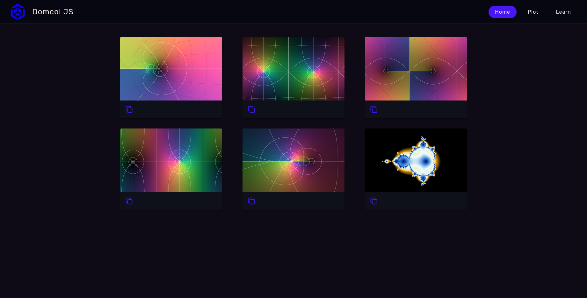
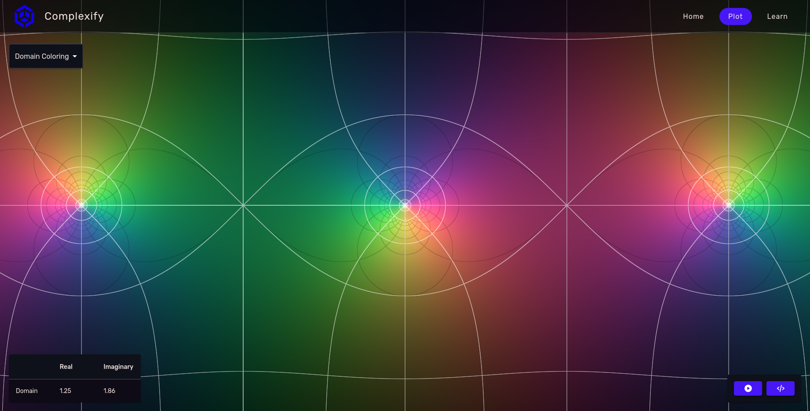
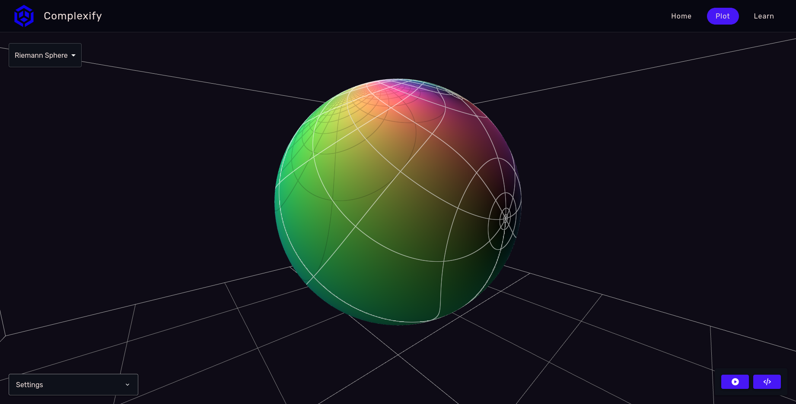
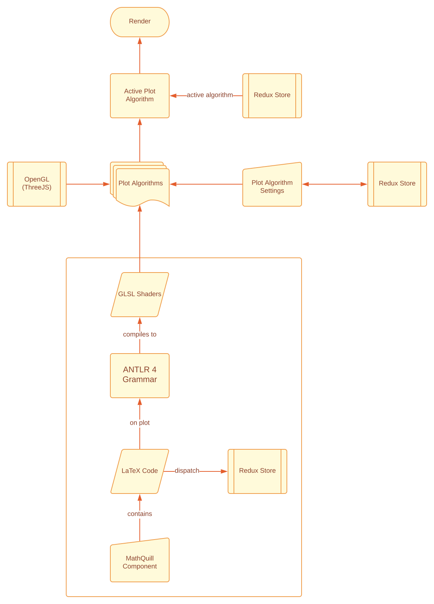

<div align="center" style="margin-top: 20px">
   
   <h1>Complexify</h1>
   <h3>complexify.vercel.app</h3>
</div>

This project is a website that visualizes
[complex functions](https://en.wikipedia.org/wiki/Complex_analysis#Complex_functions)
using standard techniques such as
[domain coloring](https://en.wikipedia.org/wiki/Domain_coloring)
and the
[stereographic projection](https://en.wikipedia.org/wiki/Stereographic_projection)
of the
[Riemann sphere](https://en.wikipedia.org/wiki/Riemann_sphere)
It utilizes a parser written in ANTLR 4
that accepts a function definition (written in [LaTeX](https://www.latex-project.org/))
and outputs code in GLSL, which is then rendered using ThreeJS.
Because of this, renders are extremely fast and can be interacted
with, e.g. by dragging the plot around or zooming into it. Equations can
be written in a built-in editor that utilizes [MathQuill](http://mathquill.com/)
to prettify LaTeX code.

# Screenshots





# Tech Stack

This website utilizes the following technologies:
- [Redux](https://redux-toolkit.js.org/)
- [Next JS](https://nextjs.org/)
- [OpenGL](https://www.opengl.org/)
- [Three JS](https://threejs.org/)
- [ANTLR 4](https://www.antlr.org/)
- [MathQuill](http://mathquill.com/)
- [Material UI](https://mui.com/)

# Flowchart

Here is an illustration of how the rendering process works:


# Project Structure

This project is structured in the following way:

- Components are stored each in their own directories under `/src/components`.
  This includes, but may not be limited to:
   - The component itself
   - Styles for the component
   - Framer-Motion animations
- Pages are stored under `/src/pages`, in accordance with the Next JS
  directory structure.
- More general styles and animations, as well as styles and animations for
  individual pages, are stored under `/src/styles`

# Installation

1. First, install all dependencies:

```shell
yarn install
```

2. Already, you can run this project on your local machine!

```shell
yarn dev
```

3. Alternatively, you can first build this project and then run the
   compiled code:

```shell
yarn build && yarn start
```

# Color Palette

Naming conventions for each color code are as per [this](https://coolors.co/) tool.
Any colors that aren't listed are either auto-generated by MUI or trivial.

| Color Name      | Color Code                                                         |
|-----------------|--------------------------------------------------------------------|
| Misty Rose      |  `#F1E1DD` |
| Electric Purple |  `#B138E2` |
| Blue            |  `#4717F6` |
| Rich Black      |  `#0E0B16` |
